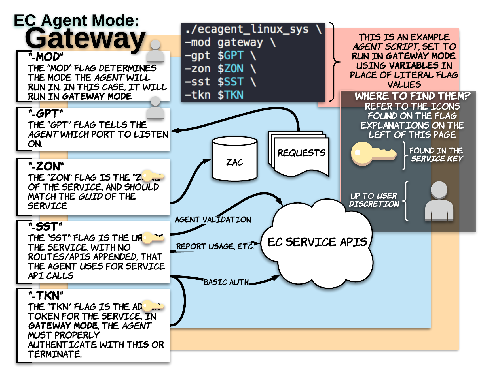
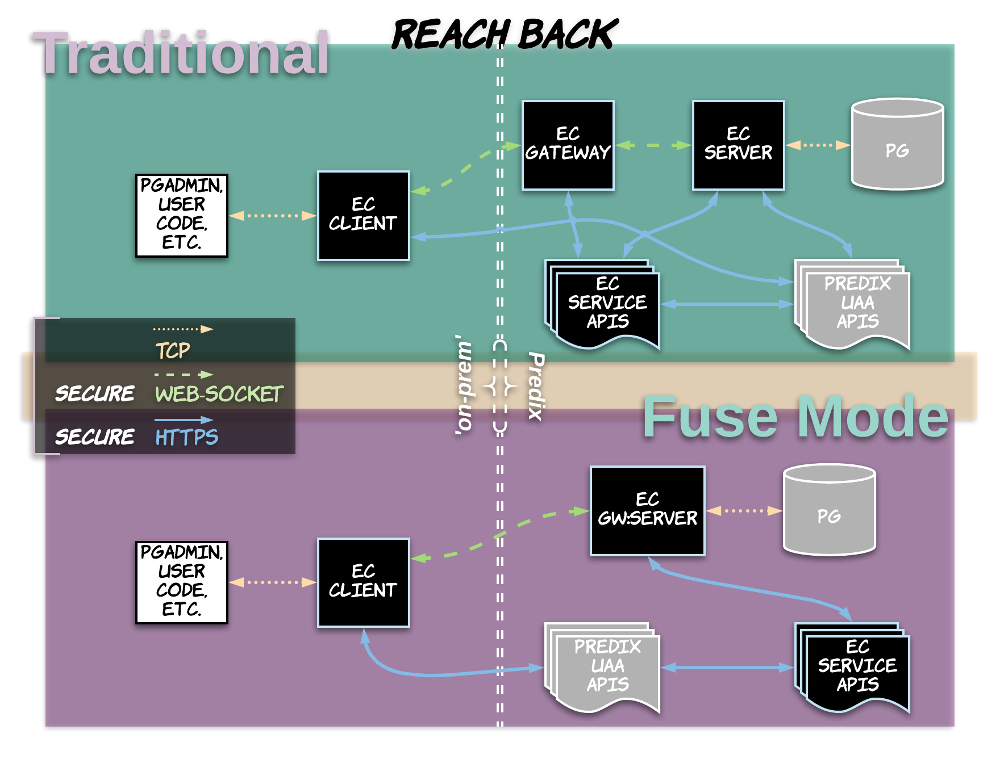
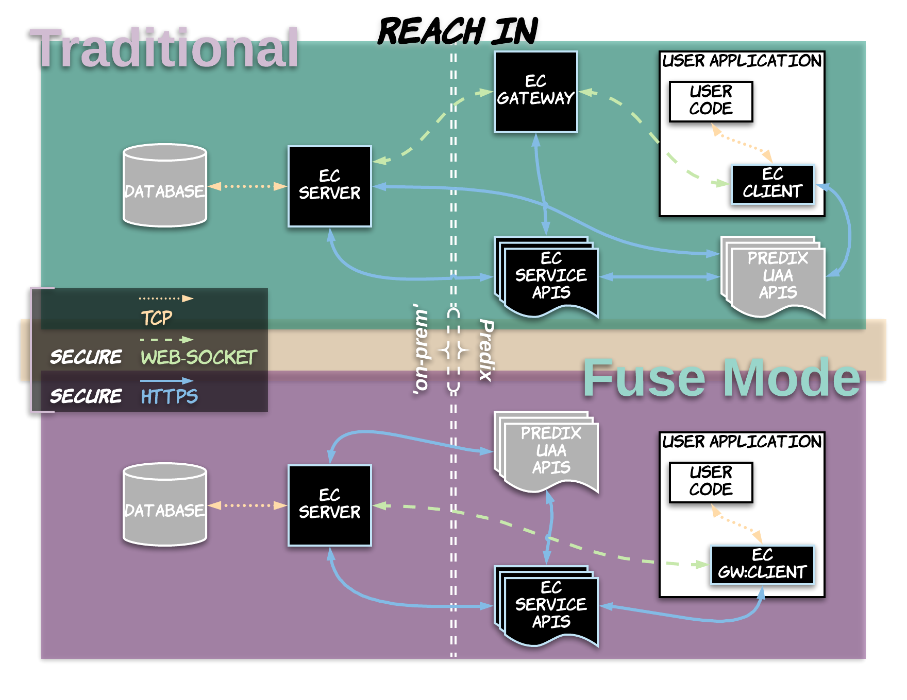

<A NAME="top">

# EC 'Modes' and Use-Case Examples

This document is designed to give a high-level understanding of the two primary 'modes' that EC can be used in ('Fuse Mode' and 'Traditional'), as well as provide abstract examples of very common use cases where EC is utilized. The purpose of the latter is to guide users in understanding how EC will fit into their existing architecture and dependencies, and to help 'visualize' this via provided diagrams.

* [What are 'Modes'?](#what-are-modes)
* [Use-Case Examples](#use-case-examples)

---

## What are 'Modes'?

Up until late 2018, the EC agents primarily only ran in a single way, or 'mode'. That is, for the most basic use case, users would need to run an EC agent gateway, an EC agent server, and an EC agent client. This is still completely valid, and will be referred to as **traditional mode**. 

As of January 2019, a new mode is available (in beta, pending production release) in which either the EC agent gateway and server processes are *fused* into a single process, or the EC agent gateway and client processes are *fused* into a single process. This results in a secure streamlining of various authorizations, and results in fewer API calls for EC-side purposes, such as the EC agent server fetching a 'gateway list' from the EC Service APIs. This is what we call **fuse mode**.

* [Traditional Modes](#traditional-modes)
* [Fuse Modes](#fuse-modes)
* [Choosing Between Modes](#choosing-between-modes)

### Traditional Modes

The traditional mode consists of running at least three EC agents: a gateway, a server, and a client. 

- Gateway
	- Usually ran in Cloud Foundry, which provides a publicly available route

 

- Server
	- Ran where the 'data' is, within the same environment/network
	- Has to make periodic calls to manage OA2 tokens
	- Has to manage a 'Gateway list' from the Service APIs

- Client
	- Ran where the data is needed
	- Can *only* be accessed via 'localhost', 127.0.0.1, etc.
	- Has to make periodic calls to manage OA2 tokens

<A HREF="#what-are-modes">What are 'Modes'?</A>

<A HREF="#top">Back To Top</A>

### Fuse Modes

When running in fuse mode, either the client or server agent process is 'fused' with the Gateway app/process. This allows for a secure streamlining of previous subprocesses, 'hops', calls, etc., which leaves more resources for transferring data.

- Gateway:Server
	- Ran where the 'data' is, within the same environment/network
	- Leveraged in use-cases where the data is in a cloud environment such as Cloud Foundry, so the Gateway will have a publicly available URL
	- Fewer total maintenance/API 'calls' than traditional Gateway and Server

- Gateway:Client
	- Ran where the data is needed
	- (WIP) 

<A HREF="#what-are-modes">What are 'Modes'?</A>

<A HREF="#top">Back To Top</A>

### Choosing Between Modes

While you can expect better overall performance from **fuse mode**, some teams and use-cases may inherently favor the decoupling of agents for manageability or other considerations. Additionally, for existing EC configurations, switching over to **fuse mode** from **traditional mode** may be more challenging than the potential gains merit.

<A HREF="#what-are-modes">What are 'Modes'?</A>

<A HREF="#top">Back To Top</A>

---

## Use-Case Examples

Please see the following examples, diagrams and pictures, which are intended to give a slightly abstracted view of how EC is able to fit into a variety of use-cases and existing, high-level system architectures. 

* [Cloud Data, Reach-Back](#cloud-data-reach-back)
* [On-Prem Data, Reach-In](#on-prem-data-reach-in)

### Cloud Data, Reach-Back

In this example, we need to get data from Postgres in Predix to an application on-prem, which has no way of natively communicating with the Postgres instance.

<A HREF="#use-case-examples">Use-Case Examples</A>

<A HREF="#top">Back To Top</A>

### On-Prem Data, Reach-In

In this example, we need to 'reach in' to the GE Network to access data that is needed by our application in Cloud Foundry. We *must* 'embed' the EC Agent Client in this application to run as a sub-process.

#### Side-By-Side Activity Comparison

<A HREF="#use-case-examples">Use-Case Examples</A>

<A HREF="#top">Back To Top</A>

---

# Notes
- diagram difference between fuse mode and traditional mode